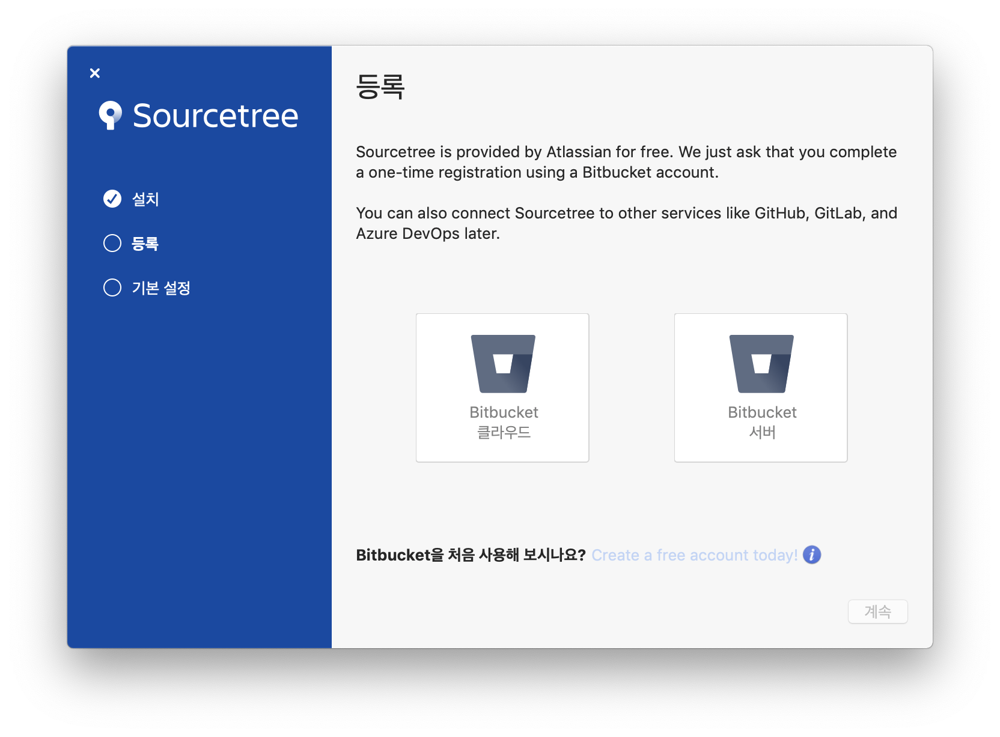
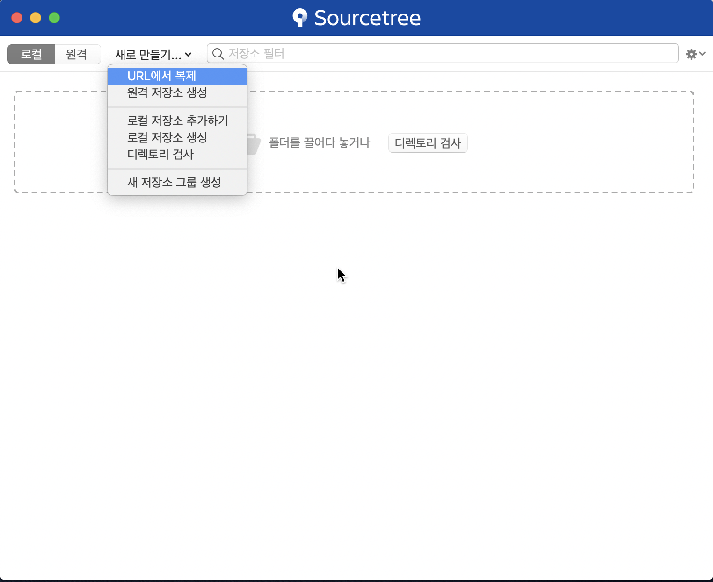
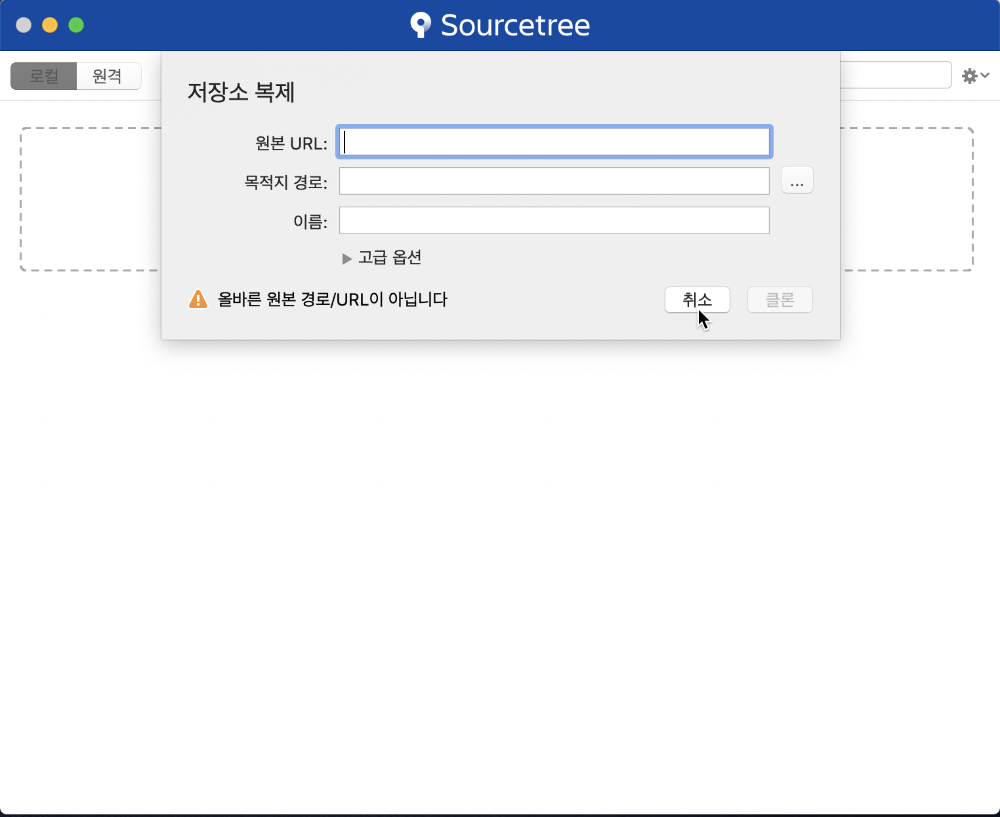
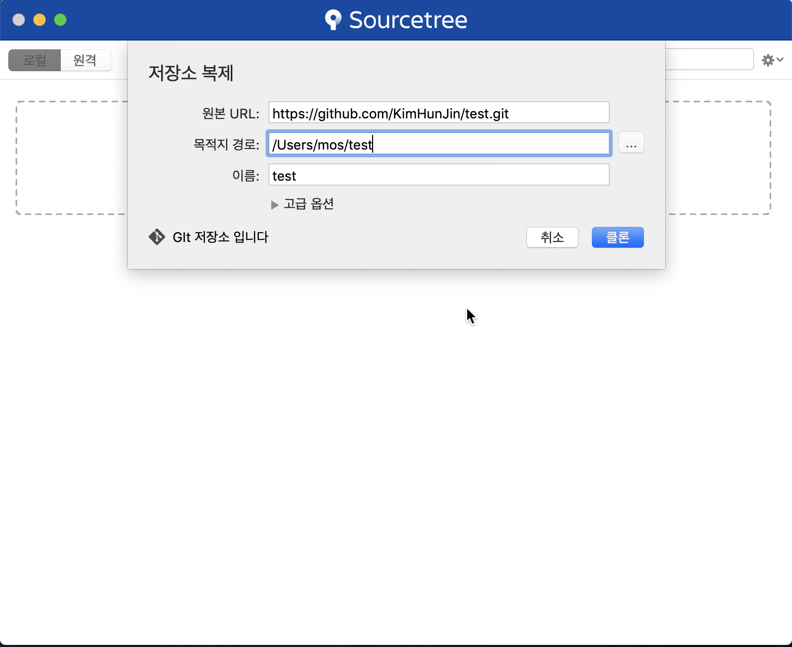
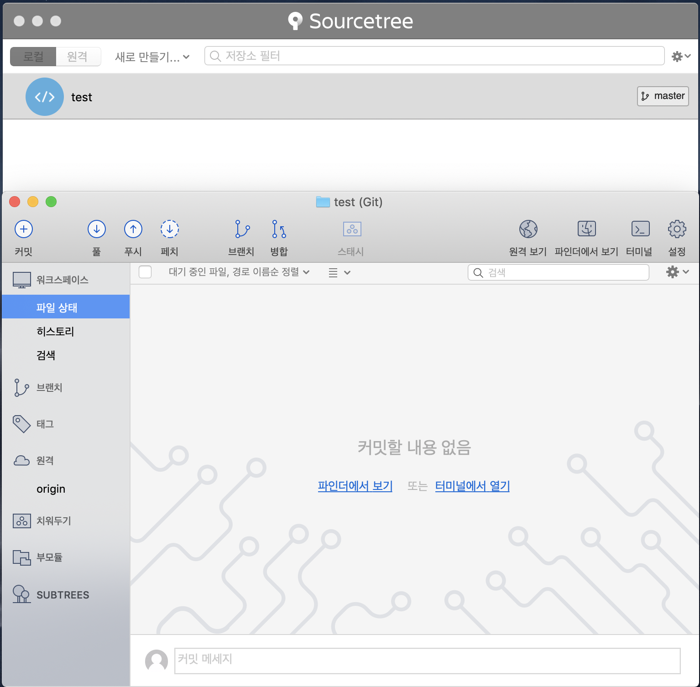
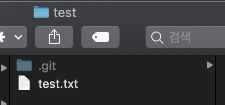
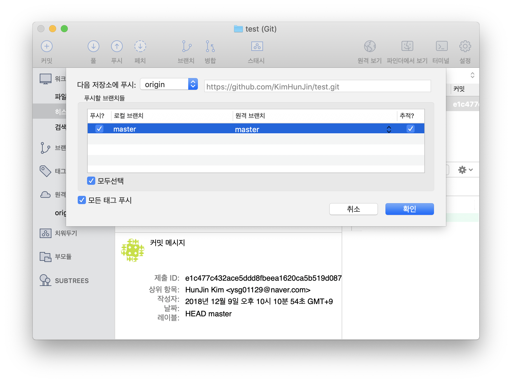
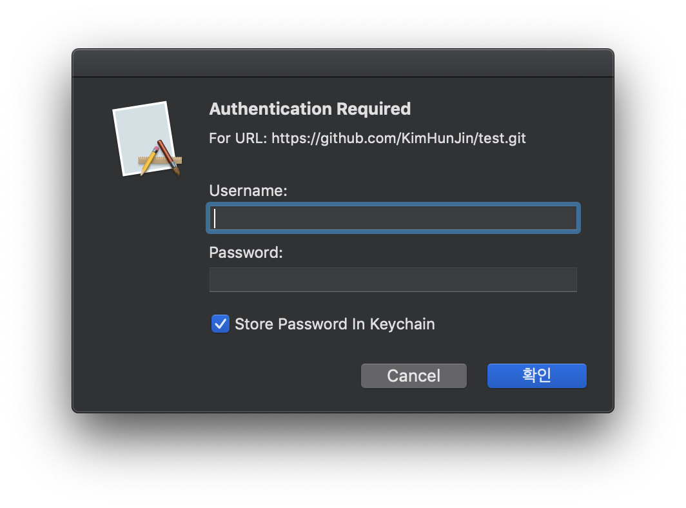

# 깃허브 가이드라인

## 깃허브 소개
깃허브(GitHub) : 분산 버전 관리 툴인 깃(Git)을 사용하는 프로젝트를 지원하는 웹 호스팅 서비스  
**오픈 소스 코드 저장소**이며 많은 오픈 소스들이 깃허브를 통해 관리되고 있다.

## 깃 소개
깃(Git) : 분산 버전 관리 툴.  
이게 뭐라고 쓸까?

예를 들어 보자..

기존 이렇게 관리를 하면서 불편함을 못느꼈다면... 

### **깃 쓰지 마러.. 인정!**

## 깃을 쓰게 되면?

변경 사항에 대해 확인이 가능해진다.

\ㅇ/ : 그렇다면 어떻게 쓸까?

[깃허브 설치](https://git-scm.com/)

자 설치를 시작하자.

* 윈도우
    
    1. 클릭  
    2. 아싸리 Next 누르기  
    3. 설치 완료
   
* 맥
    1. terminal 실행
    2. git --version 입력
    3. 설치하라는 문구가 나오면 YES
    4. 기다리면 끝
    
    
## 깃 가지고 놀기

주로 사용하게 될 명령어는 크게 4가지다.

1. git commit
    * 코드의 변경 사항을 저장한다.
2. git push
    * 로컬 저장소에 저장된 변경 내용을 깃허브 혹은 깃 서버로 전송한다.
3. git pull
    * 깃허브 혹은 깃 서버에 있는 내용을 로컬 저장소로 이동한다.
4. git checkout name
    * 브랜치를 이동한다.
    
글로 적어봣자 들어오지도 않는다.

### 깃허브 계정 만들기

우선 깃허브 게정부터 만들자.

[깃허브](https://github.com) 이 링크로 들어가서 가입

깃허브 게정을 만들었으면, 저장소를 만든다.

1. 이런 창이나

2. 이런 창이 보이면 NEW 클릭

3. 이름을 입력하고 생성

    
4. 이런 창이 나오고, 보이는 경로 복사

### 깃허브 사용 해보기 (bash)

git bash 실행
    > window 유저라면 git bash 실행  
    맥 유저라면 terminal 실행
    
1. 폴더 생성 (바탕화면에 만들었다.)
2. 폴더로 이동
3. 명령어 입력 (git clone "복사한 URL")
    
        
4. 폴더 이동 (폴더가 하나 생겼을 거다.)
    

5. 텍스트 파일 생성
    

6. 명령어 입력 (git add *)
7. 명령어 입력 (git commit -m "메시지")
    

8. 명령어 입력 git config --global user.name "깃허브 가입할 때 사용한 이름"
9. 명령어 입력 git config --global user.email "깃허브 가입할 때 사용한 이메일"
10. 명령어 입력 git push
    

11. 확인
    
        

## 소스트리 사용방법
소트트리는 깃 명령어 (pull, commit 등)을 잘 모르더라도 GUI	로 쉽게 깃을 사용할 수 있게 도와주는 IDE이다.

### 소스트리 설치하기 (맥, 윈도우 동일)

1. 소스트리 설치 ; [링크](https://www.sourcetreeapp.com/)

2. 소스트리 및 빗버킷 가입 

	
	
	Bitbucket 클라우드 클릭  
	소스트리 및 빗 버킷 가입하여 진행

3. 인증

	
	
4. 다음과 같은 화면이 나오면 기본적인 세팅 완료

	
	
### 소스트리 사용하기

1. [깃허브 만들기](#깃허브-계정-만들기) 페이지에서 만들었던 레포지토리 가져오기
	
	다음 화면에서 새로만들기 - URL복제를 클릭한다.  
	클릭 후 앞서 만든 깃허브 레포지토리를 입력한다.
	
	
	
	
	
	
	
2. 클론 하기

	클론에 성공하면 다음과 같이 화면에 레포지토리 리스트에 추가되고, 워크스페이스 창이 나타난다.
	
	
	
3. 테스트 파일 생성해보기

	클론에 성공했으면 복제한 폴더로 이동하여 텍스트 파일을 하나 만든다.
	
	
	
4. 테스트 파일 커밋하기

	소스트리로 돌아가 생성한 테스트 파일이 다음과 같이 생성됐는지 확인한다.
	
	
	
	확인이 됐으면 체크박스를 선택하고 커밋한다.

	
	
	커밋 메시지를 작성하고 커밋 버튼을 누르면 다음과 같이 팝업이 생성된다. 확인을 누르도록 하자.
	
	
	
5. 히스토리 확인하기

	커밋을 성공적으로 완료 했으면 히스토리에 커밋 내용이 추가된 것을 볼 수 있다.
	
	
	
6. 푸시 하기

	성공적으로 커밋을 완료 했으면 푸시(Push)를 클릭하여 원격저장소로 업로드한다.
	
	
	
	확인을 누르면 로그인 팝업이 나오며, 깃허브 계정 정보를 입력하면 된다.  
	(**주의**; 빗버킷이나 소스트리의 계정정보가 아니다.)
	
	
	
7. 확인하기

	성공적으로 푸시를 완료 했으면 원격 저장소인 깃허브 저장소로 이동한다.
	
	다음과 같이 파일이 생성됐음을 볼 수 있다.
	
	
	
8. 마무리

	클론을 통하여 다른 레포지토리 역시 가져올 수 있다. 깃허브에 공개 된 모든 코드는 오픈소스이며, 라이센스만 잘 명시해 주면 사용하는 데 지장없다.
	
	깃/깃허브 사용방법은 기본적으로 꼭 알아둬야 할 지식이다. 앞으로 자주 사용하게 될 테니 익숙해지고, 일일커밋은 힘들더라도 주기적으로 커밋을 하며 깃허브를 관리하는 좋은 습관을 들이기를 추천한다. 
	
	( 잔디가 심어지는 것을 보면 내심 뿌듯하다 :D )