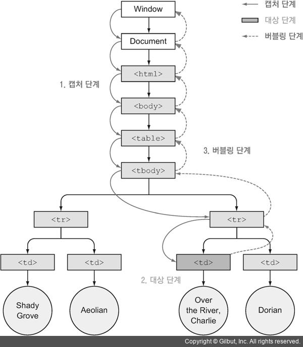

# 6. React에서 이벤트 다루기

## 6.1 React에서 DOM 이벤트 다루기

ex) event Handler class
```
class SaveButton extends React.Component {
    handleSave(event) {
        console.log(this, event)
    }
    render() {
        return <button onClick={this.handleSave.bind(this)}>
            save
        </button>
    }
}
```


ex) constructor을 이용한 바인딩
```
class SaveButton extends React.Component {
    constructor(props) {
        super(props)
        this.handleSave = this.handleSave.bind(this)
    }
    handleSave(event) {
        console.log(this, event)
    }
    render() {
        return <button onClick={this.handleSave}?
            save
        </button>
    }
}
```

### 6.1.1 캡처 및 버블링 단계


### 6.1.2 React 이벤트 살펴보기

### 6.1.3 React 합성 이벤트 객체 다루기
> 크로스 브라우징 문제 해결

ex) 합성 이벤트 핸들러
```
class Mouse extends React.Component {
    handleMouseOver(event) {
        console.log('mouse is over with event')
        console.dir(event.target)
    }
    render() {
        return <div>
            <div
                style = {{border: '1px solid red'}]
                onMouseOver={this.handleMouseOver.bind(this)}>
                Open DevTools and move your mouse cursor over here
            </div>
        </div>
    }
}
```

### 6.1.4 이벤트와 상태 사용하기

### 6.1.5 이벤트 핸들러를 속성으로 전달하기
> 상태 비저장 이벤트 처리 방법은 이벤트 핸들러를 상태비저장 컴포넌트의 속성으로 전달하고, 
> 전달한 이벤트 핸들러 함수를 상태비저장 컴포넌트에서 실행하도록 하는 것이다.

ex) 상태비저장 버튼 컴포넌트
```
class ClickCounterButton extends React.Component {
    render() {
        return <button
            onClick={this.props.handler}
            className="btn btn-danger">
            Increase Volume (Current volume is {this.props.counter})
        </button>
    }
}
```

ex) 이벤트 핸들러를 속성으로 전달
```
class Content extends React.Component {
    constructor(props) {
        super(props)
        this.handleClick = this.handleClick.bind(this)
        this.state = {counter: 0}
    }
    handleClick(event) {
        this.setState({counter: ++this.state.counter})
    }
    render() {
        return (
            <div>
                <ClickCounterButton
                    counter={this.state.counter}
                    handler={this.handleClick} />
            </div>
        )
    }
}
```

### 6.1.6 컴포넌트 간의 데이터 교환
> 부모 컴포넌트에 이벤트 핸들러를 두어 자식 컴포넌들과 정보 교환

ex) Content에서 전달한 이벤트 핸들러를 사용하는 버튼 컴포넌트
```
const ClickCounterButton = (props) => {
    return <button
        OnClick={props.handler}
        className="btn btn-info">
        Don't touch me with your dirty hands!
    </button>
}

class Counter extends React.Component {
    render() {
        return <span>Clicked {this.props.value} times. </span>
    }
}
```

ex) 두 개의 컴포넌트에 이벤트 핸들러와 상태 전달하는 부모 컴포넌트
```
calss Content extends React.Component {
    constructor(props) {
        super(props)
        this.handleClick = this.handleClick.bind(this)
        this.state = {counter: 0}
    }
    handleClick(event) {
        this.setState({counter: ++this.state.counter})
    }
    render() {
        return (
            <div>
                <ClickCounterButton handler={this.handleClick}/>
                <br />
                <Counter value={this.state.counter}/>
            </div>
        )
    }
}
```

## 6.2 React가 지원하지 않는 DOM 이벤트 처리하기
> React는 resize 이벤트를 지원하지 않음. <br/>
> 미지원 이벤트를 연결하기 위해 컴포넌트 라이프사이클 이벤트를 사용

ex) DOM 이벤트에 연결하기 위한 라이프사이클 이벤트 사용하기
```
class Radio extends React.Component {
    constructor(props) {
        super(props)
        this.handleResize = this.handleResize.bind(this)
        let order = props.order
        let i = 1
        this.state = {
            outerStyle: this.getStyle(4, i),
            innerStyle: this.getStyle(1, i),
            selectedStyle: this.getStyle(2, i),
            taggerStyle: {top: order*20, width: 25, height: 25}
        }
    }
    getStyle(i, m) {
        let value = i * m
        return {
            top: value,
            bottom: value,
            left: value,
            right: value,
        }
    }
    componentDidMount() {
        window.addEventListener('resize', this.handleResize)
    }
    componentWillUnmount() {
        window.removeEventListener('resize', this.handleResize)
    }
    handleResize(event) {
        let w = 1 + Math.round(window.innerWidth / 300)
        this.setState({
            taggerStyle: {top: this.props.order * w * 10, width: w * 10, height: w * 10},
            textStyle: {left: w * 13, fontSize: 7 * w}
        })
    }
    
    render() {
        return <div>
            <div className="radio-tagger" style={this.state.taggerStyle}>
                <input type="radio" name={this.props.name} id={this.props.id} />
                <label htmlFor={this.props.id}>
                    <div className="radio-text" style={this.state.textStyle}> {this.props.label} </div>
                    <div className="radio-outer" style={this.state.outerStyle}>
                        <div className="radio-inner" style={this.state.innerStyle}>
                            <div className="radio-selected" style={this.state.selectedStyle} />
                        </div>
                    </div>
                </label>
            </div>
        </div>
    }
}
```

## 6.3 React를 다른 라이브러리와 통합하기: jQuery UI 이벤트

## 요약
* onClick은 마우스와 트랙패드의 클릭을 캡처한다.
* JSX 문법으로 이벤트 리스너를 추가할 때는 <a onNAME={this.METHOD}>로 작성한다.
* constructor() 또는 JSX를 이용해 bind()로 이벤트 핸들러에 this를 바인딩해서 컴포넌트 클래스의 인스턴스에 접근할 수 있다.
* componentDidMount()는 브라우저에서만 실행된다. componentWillMount()는 브라우저와 서버 측 렌더링에서 모두 실행된다.
* React는 합성 이벤트 객체를 제공함으로써 거의 대부분의 표준 HTML DOM 이벤트를 지원한다.
* React를 다른 프레임워크와 통합하거나 React가 지원하지 않는 이벤트를 처리하기 위해 componentDidMount()와 componentWillUnmount()를 사용할 수 있다.